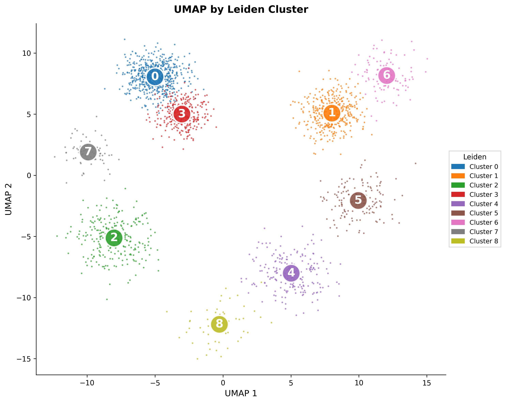
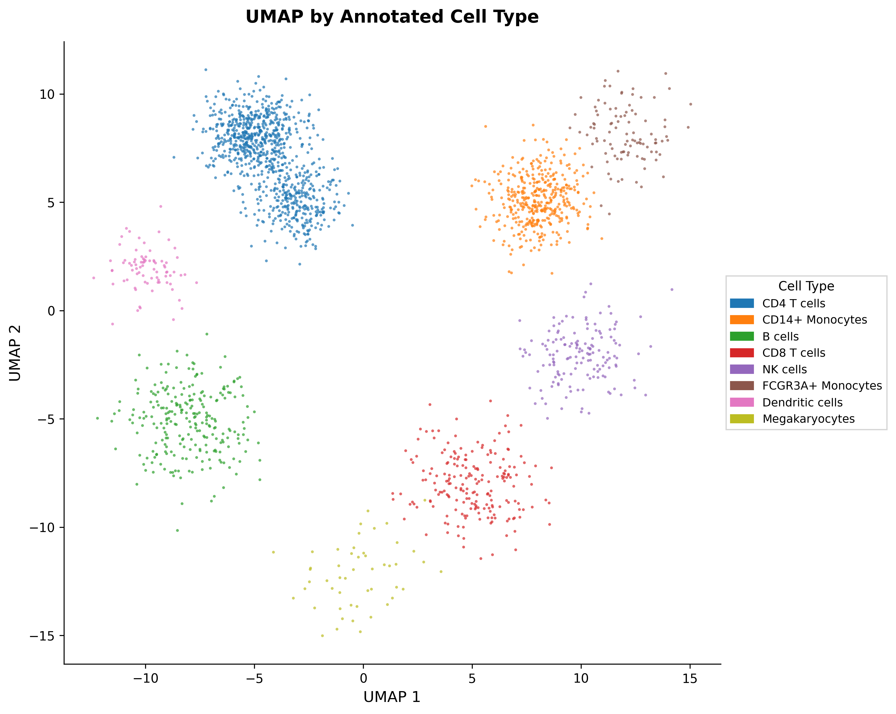

# Scanpy Single-Cell RNA-Seq Clustering Tool

[](https://opensource.org/licenses/MIT)

[](https://github.com/olaflaitinen/scRNA-Seq-Clustering-Tool/actions/workflows/jupyter-ci.yml)

An implementation of a standard single-cell RNA-Seq (scRNA-Seq) analysis workflow using the Python package `scanpy`. This project serves as a practical demonstration of the skills acquired from a Single-Cell RNA-Seq analysis certificate.

The workflow covers data loading, quality control, normalization, dimensionality reduction, clustering, and cell type annotation using known marker genes.

### Analysis Workflow

The pipeline follows the standard best practices for scRNA-Seq analysis:

1.  **Data Loading**: Read 10x Genomics-formatted data.
2.  **Quality Control (QC)**: Filter out low-quality cells and genes.
3.  **Normalization**: Normalize and log-transform the count data.
4.  **Feature Selection**: Identify highly variable genes.
5.  **Dimensionality Reduction**: Perform PCA and UMAP.
6.  **Clustering**: Identify cell clusters using the Leiden algorithm.
7.  **Marker Gene Identification**: Find differentially expressed genes for each cluster.
8.  **Cell Type Annotation**: Assign biological cell types to clusters based on marker genes.

### Key Visualizations

The primary outputs are UMAP plots, which visualize the cell-to-cell similarity in 2D space.

| UMAP by Leiden Cluster | UMAP by Annotated Cell Type |
| :--------------------: | :-------------------------: |
|  |  |

### Installation

1.  **Clone the repository:**
    ```bash
    git clone https://github.com/olaflaitinen/scRNA-Seq-Clustering-Tool.git
    cd scRNA-Seq-Clustering-Tool
    ```

2.  **Create and activate a virtual environment:**
    ```bash
    python3 -m venv venv
    source venv/bin/activate
    ```

3.  **Install dependencies:**
    ```bash
    pip install -r requirements.txt
    ```

### Usage

#### 1. Download the Data

This workflow uses the publicly available 3k PBMC dataset from 10x Genomics. A helper script is not included, so please download and extract it manually.

```bash
# Create the data directory
mkdir -p data/pbmc3k/

# Download and extract the data
curl -o data/pbmc3k_filtered_gene_bc_matrices.tar.gz http://cf.10xgenomics.com/samples/cell-exp/1.1.0/pbmc3k/pbmc3k_filtered_gene_bc_matrices.tar.gz
tar -xzf data/pbmc3k_filtered_gene_bc_matrices.tar.gz -C data/pbmc3k/
```
This will create the required `data/pbmc3k/filtered_gene_bc_matrices/hg19/` directory structure.

#### 2. Run the Analysis Notebook

The entire workflow is documented in a single Jupyter Notebook. Launch Jupyter Lab and open the notebook to run the analysis step-by-step.

```bash
jupyter-lab notebooks/scrna_analysis_workflow.ipynb
```

### License

This project is licensed under the MIT License. See the [LICENSE](LICENSE) file for details.
