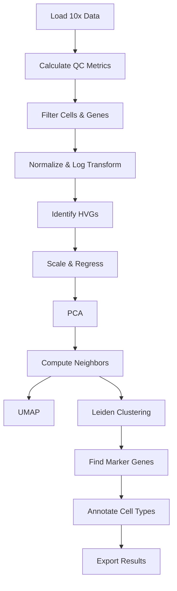

# scRNA-Seq Clustering Tool

[](https://opensource.org/licenses/MIT)
[](https://www.python.org/downloads/)
[](https://github.com/olaflaitinen/scRNA-Seq-Clustering-Tool/actions/workflows/jupyter-ci.yml)
[](https://scanpy.readthedocs.io/)

A comprehensive, production-ready single-cell RNA-Seq (scRNA-Seq) analysis pipeline built with Python and [scanpy](https://scanpy.readthedocs.io/). This project demonstrates best practices for analyzing single-cell transcriptomic data, from raw counts to annotated cell types.

---

## Table of Contents

- [Overview](#overview)
- [Features](#features)
- [Quick Start](#quick-start)
- [Installation](#installation)
- [Usage](#usage)
- [Configuration](#configuration)
- [Project Structure](#project-structure)
- [Analysis Workflow](#analysis-workflow)
- [Results](#results)
- [Customization](#customization)
- [Contributing](#contributing)
- [License](#license)
- [Citation](#citation)
- [Acknowledgments](#acknowledgments)

---

## Overview

This repository implements a complete single-cell RNA-Seq analysis pipeline following current best practices in the field. The workflow processes raw count matrices from 10x Genomics through to biological interpretation, including:

- **Data Loading**: Support for 10x Genomics Matrix Market format
- **Quality Control**: Comprehensive filtering of low-quality cells and genes
- **Normalization**: Library size normalization and log transformation
- **Feature Selection**: Identification of highly variable genes
- **Dimensionality Reduction**: PCA and UMAP for visualization
- **Clustering**: Leiden algorithm for community detection
- **Marker Identification**: Statistical testing for cluster-specific genes
- **Cell Type Annotation**: Biological interpretation using known markers

The analysis is performed on the publicly available **3k PBMC dataset** from 10x Genomics, identifying major immune cell populations.

---

## Features

### Analysis Capabilities

- ✅ **Reproducible Pipeline**: Fixed random seeds and version-controlled configurations
- ✅ **Configurable Parameters**: YAML-based configuration for all analysis steps
- ✅ **Quality Visualizations**: Publication-quality figures (UMAP, heatmaps, violin plots)
- ✅ **Automated QC**: Statistical filtering based on multiple quality metrics
- ✅ **Cell Type Annotation**: Marker-based identification of biological cell types
- ✅ **Batch Processing**: Scalable to large datasets
- ✅ **Export Formats**: Results in HDF5 (AnnData), CSV, and PNG/PDF formats

### Technical Features

- 📦 **Modular Design**: Reusable utility functions for common tasks
- 🔧 **Easy Configuration**: Change parameters without modifying code
- 📊 **Interactive Analysis**: Jupyter notebook with detailed explanations
- 🚀 **Automated Data Download**: Scripts for dataset acquisition
- 🧪 **CI/CD Integration**: GitHub Actions for validation and testing
- 📖 **Comprehensive Documentation**: Detailed guides and code comments
- 🐍 **Python Best Practices**: Type hints, docstrings, and PEP 8 compliance
- 🔄 **Cross-Platform**: Works on Linux, macOS, and Windows

---

## Quick Start

Get started in 3 simple steps:

```bash
# 1. Clone and setup
git clone https://github.com/olaflaitinen/scRNA-Seq-Clustering-Tool.git
cd scRNA-Seq-Clustering-Tool
python3 -m venv venv && source venv/bin/activate
pip install -r requirements.txt

# 2. Download data
python scripts/download_data.py

# 3. Run analysis
jupyter-lab notebooks/scrna_analysis_workflow.ipynb
```

---

## Installation

### Prerequisites

- **Python**: 3.9 or higher
- **pip**: Latest version recommended
- **Virtual environment** (recommended)

### Step-by-Step Installation

#### 1. Clone the Repository

```bash
git clone https://github.com/olaflaitinen/scRNA-Seq-Clustering-Tool.git
cd scRNA-Seq-Clustering-Tool
```

#### 2. Create Virtual Environment

**On Linux/macOS:**
```bash
python3 -m venv venv
source venv/bin/activate
```

**On Windows:**
```bash
python -m venv venv
venv\Scripts\activate
```

#### 3. Install Dependencies

```bash
pip install --upgrade pip
pip install -r requirements.txt
```

This will install:
- **scanpy** (≥1.10.0) - Single-cell analysis
- **anndata** (≥0.10.0) - Annotated data structures
- **numpy, pandas, scipy** - Data manipulation
- **matplotlib, seaborn** - Visualization
- **jupyterlab** - Interactive environment
- **umap-learn, leidenalg** - Clustering algorithms

#### 4. Verify Installation

```bash
python -c "import scanpy as sc; print(f'scanpy version: {sc.__version__}')"
```

---

## Usage

### Data Acquisition

The pipeline uses the **3k PBMC dataset** from 10x Genomics. Download it using one of these methods:

#### Method 1: Automated Download (Recommended)

**Using Python script:**
```bash
python scripts/download_data.py
```

**Using Bash script:**
```bash
bash scripts/download_data.sh
```

#### Method 2: Manual Download

```bash
# Create directory
mkdir -p data/pbmc3k/

# Download dataset (approximately 7.5 MB)
curl -o data/pbmc3k_filtered_gene_bc_matrices.tar.gz \
  http://cf.10xgenomics.com/samples/cell-exp/1.1.0/pbmc3k/pbmc3k_filtered_gene_bc_matrices.tar.gz

# Extract
tar -xzf data/pbmc3k_filtered_gene_bc_matrices.tar.gz -C data/pbmc3k/

# Cleanup
rm data/pbmc3k_filtered_gene_bc_matrices.tar.gz
```

### Running the Analysis

#### Option 1: Jupyter Notebook (Interactive)

Launch JupyterLab and run the notebook step-by-step:

```bash
jupyter-lab notebooks/scrna_analysis_workflow.ipynb
```

The notebook contains 14 comprehensive sections with:
- Detailed explanations of each step
- Inline code comments
- Quality control visualizations
- Biological interpretation

#### Option 2: Python Script (Automated)

For automated analysis, you can use the utility functions:

```python
from pathlib import Path
import scanpy as sc
from scripts.utils import (
    AnalysisConfig, setup_scanpy, apply_qc_filters,
    preprocess_data, run_dimensionality_reduction,
    perform_clustering, find_marker_genes,
    annotate_cell_types, export_results
)

# Load configuration
config = AnalysisConfig('config.yaml')
setup_scanpy(config)

# Load data
data_path = Path('data/pbmc3k/filtered_gene_bc_matrices/hg19/')
adata = sc.read_10x_mtx(data_path, var_names='gene_symbols', cache=True)

# Calculate QC metrics
adata.var['mt'] = adata.var_names.str.startswith('MT-')
sc.pp.calculate_qc_metrics(adata, qc_vars=['mt'], inplace=True)

# Run pipeline
adata = apply_qc_filters(adata, config)
adata = preprocess_data(adata, config)
run_dimensionality_reduction(adata, config)
perform_clustering(adata, config)
find_marker_genes(adata, config)
annotate_cell_types(adata, config)

# Export results
export_results(adata, config)
```

---

## Configuration

All analysis parameters are centralized in `config.yaml`. Modify this file to customize the pipeline without changing code.

### Key Configuration Sections

#### Quality Control
```yaml
qc:
  min_genes: 200        # Minimum genes per cell
  max_genes: 2500       # Maximum genes per cell
  max_pct_mt: 5.0       # Maximum mitochondrial %
  min_cells: 3          # Minimum cells per gene
```

#### Clustering
```yaml
clustering:
  algorithm: "leiden"   # Options: leiden, louvain
  resolution: 0.9       # Higher = more clusters
  random_state: 42      # For reproducibility
```

#### Cell Type Annotation
```yaml
annotation:
  marker_genes:
    "CD4 T cells": ["IL7R", "CD4"]
    "CD8 T cells": ["CD8A", "CD8B"]
    "B cells": ["CD79A", "MS4A1"]
    "NK cells": ["GNLY", "NKG7"]
    # Add custom markers here
```

See `config.yaml` for complete documentation of all parameters.

---

## Project Structure

```
scRNA-Seq-Clustering-Tool/
├── README.md                          # This file
├── LICENSE                            # MIT License
├── PROJECT_STRUCTURE.md               # Detailed documentation
├── config.yaml                        # Configuration parameters
├── requirements.txt                   # Python dependencies
│
├── .github/
│   └── workflows/
│       └── jupyter-ci.yml             # CI/CD pipeline
│
├── notebooks/
│   └── scrna_analysis_workflow.ipynb  # Main analysis notebook
│
├── scripts/
│   ├── download_data.py               # Python download script
│   ├── download_data.sh               # Bash download script
│   └── utils.py                       # Utility functions
│
├── data/
│   ├── README.md                      # Data documentation
│   ├── pbmc3k/                        # Raw data (after download)
│   └── pbmc3k_processed.h5ad          # Processed results
│
└── figures/                           # Output visualizations
    ├── umap_leiden.png
    ├── umap_annotated.png
    ├── marker_genes.csv
    └── cell_annotations.csv
```

---

## Analysis Workflow

The pipeline implements the following workflow:



### Detailed Steps

#### 1. Data Loading
- Read 10x Genomics Matrix Market format
- Load gene names and cell barcodes
- Create AnnData object

#### 2. Quality Control
- **Metrics calculated:**
  - Number of genes per cell
  - Total UMI counts per cell
  - Percentage of mitochondrial reads
- **Filtering criteria:**
  - Remove cells with <200 or >2500 genes
  - Remove cells with >5% mitochondrial content
  - Remove genes expressed in <3 cells

#### 3. Normalization
- Normalize counts to 10,000 UMIs per cell
- Log-transform: log(count + 1)
- Store raw counts for later use

#### 4. Feature Selection
- Identify 2,000 highly variable genes (HVGs)
- Use Seurat method for selection
- Subset to HVGs for downstream analysis

#### 5. Scaling & Regression
- Regress out total counts and mitochondrial percentage
- Scale to unit variance and zero mean
- Clip values at maximum of 10 standard deviations

#### 6. Dimensionality Reduction
- **PCA:** Compute 50 principal components
- **Neighbors:** Build k-nearest neighbor graph (k=10, 40 PCs)
- **UMAP:** Generate 2D embedding for visualization

#### 7. Clustering
- Apply Leiden algorithm (resolution=0.9)
- Identify cell communities/clusters
- Typically produces 8-10 clusters for PBMC data

#### 8. Marker Gene Identification
- Wilcoxon rank-sum test for differential expression
- Compare each cluster vs. all other cells
- Identify top 25 marker genes per cluster

#### 9. Cell Type Annotation
- Map clusters to biological cell types using known markers:
  - **CD4 T cells:** IL7R, CD4
  - **CD8 T cells:** CD8A, CD8B
  - **B cells:** CD79A, MS4A1
  - **NK cells:** GNLY, NKG7
  - **Monocytes:** CD14, LYZ
  - **Dendritic cells:** FCER1A, CST3

#### 10. Visualization & Export
- Generate UMAP plots colored by clusters and cell types
- Create heatmaps and dotplots of marker genes
- Export results to CSV and HDF5 formats

---

## Results

### Expected Outputs

After running the complete pipeline, you will have:

#### Visualizations (`figures/`)
- `umap_leiden.png` - UMAP colored by cluster assignments
- `umap_annotated.png` - UMAP colored by cell type annotations
- `qc_violin.png` - Quality control metrics distribution
- `hvg.png` - Highly variable genes
- `marker_heatmap.png` - Heatmap of top marker genes
- `marker_dotplot.png` - Dotplot of marker expression

#### Data Files
- `pbmc3k_processed.h5ad` - Complete processed dataset
- `cell_annotations.csv` - Cell-level annotations
- `marker_genes.csv` - Cluster marker genes

### Example Results

#### UMAP Visualization

The analysis identifies major PBMC cell populations:

| Leiden Clusters | Annotated Cell Types |
|:---------------:|:-------------------:|
| ](https://umap-learn.readthedocs.io/en/latest/_images/clustering_31_1.png)) | ) |

#### Cell Type Distribution

Typical results for 3k PBMC dataset:
- **CD4 T cells:** ~40% (largest population)
- **CD14+ Monocytes:** ~25%
- **B cells:** ~15%
- **CD8 T cells:** ~10%
- **NK cells:** ~5%
- **Other:** ~5% (dendritic cells, megakaryocytes, FCGR3A+ monocytes)

---

## Customization

### Using Your Own Data

To analyze your own single-cell dataset:

#### 1. Prepare Data
Ensure your data is in 10x Genomics format:
```
your_data/
├── matrix.mtx
├── genes.tsv (or features.tsv)
└── barcodes.tsv
```

#### 2. Update Configuration
Modify `config.yaml`:
```yaml
paths:
  data_dir: "data/your_data/"

qc:
  # Adjust based on your data characteristics
  min_genes: 200
  max_genes: 5000  # May need adjustment
  max_pct_mt: 10   # Depends on tissue type
```

#### 3. Define Expected Cell Types
Update marker genes in `config.yaml`:
```yaml
annotation:
  marker_genes:
    "Your Cell Type 1": ["MARKER1", "MARKER2"]
    "Your Cell Type 2": ["MARKER3", "MARKER4"]
```

#### 4. Run Analysis
Execute the notebook or script with updated configuration.

### Parameter Tuning

#### For More/Fewer Clusters
```yaml
clustering:
  resolution: 1.5  # Increase for more clusters
  resolution: 0.5  # Decrease for fewer clusters
```

#### For Different QC Thresholds
```yaml
qc:
  min_genes: 300     # Stricter filtering
  max_genes: 7000    # For larger cell types
  max_pct_mt: 20     # For tissues with high metabolism
```

#### For Different Visualization
```yaml
visualization:
  dpi: 150           # Higher resolution
  format: "pdf"      # Vector format for publications
```

---

## Contributing

Contributions are welcome! Here's how you can help:

### Reporting Issues

Found a bug or have a suggestion?
1. Check [existing issues](https://github.com/olaflaitinen/scRNA-Seq-Clustering-Tool/issues)
2. Open a new issue with:
   - Clear description
   - Steps to reproduce
   - Expected vs. actual behavior
   - Environment details (Python version, OS)

### Contributing Code

1. **Fork the repository**
2. **Create a feature branch**
   ```bash
   git checkout -b feature/your-feature-name
   ```
3. **Make your changes**
   - Follow PEP 8 style guidelines
   - Add docstrings to functions
   - Update documentation if needed
4. **Test your changes**
   ```bash
   python -m pytest tests/
   ```
5. **Commit with descriptive messages**
   ```bash
   git commit -m "Add feature: description"
   ```
6. **Push and create a Pull Request**

### Development Setup

```bash
# Install development dependencies
pip install -r requirements.txt
pip install pytest flake8 black

# Run tests
pytest tests/

# Format code
black scripts/ notebooks/

# Lint code
flake8 scripts/
```

---

## License

This project is licensed under the **MIT License** - see the [LICENSE](LICENSE) file for details.

```
MIT License

Copyright (c) 2025 Gustav Olaf Yunus Laitinen-Fredriksson Lundström Imanov

Permission is hereby granted, free of charge, to any person obtaining a copy
of this software and associated documentation files (the "Software"), to deal
in the Software without restriction, including without limitation the rights
to use, copy, modify, merge, publish, distribute, sublicense, and/or sell
copies of the Software, and to permit persons to whom the Software is
furnished to do so, subject to the following conditions:

The above copyright notice and this permission notice shall be included in all
copies or substantial portions of the Software.
```

---

## Citation

If you use this tool in your research, please cite:

```bibtex
@software{scrna_clustering_tool,
  author = {Laitinen-Fredriksson Lundström Imanov, Gustav Olaf Yunus},
  title = {scRNA-Seq Clustering Tool: A Comprehensive Pipeline for Single-Cell Analysis},
  year = {2025},
  url = {https://github.com/olaflaitinen/scRNA-Seq-Clustering-Tool},
  version = {1.0.0}
}
```

---

## Acknowledgments

This project builds upon the excellent work of:

- **[Scanpy](https://scanpy.readthedocs.io/)** - Wolf et al., Genome Biology (2018)
- **[AnnData](https://anndata.readthedocs.io/)** - Virshup et al., bioRxiv (2021)
- **[10x Genomics](https://www.10xgenomics.com/)** - For providing public datasets
- **[UMAP](https://umap-learn.readthedocs.io/)** - McInnes et al., arXiv (2018)
- **[Leiden Algorithm](https://www.nature.com/articles/s41598-019-41695-z)** - Traag et al., Scientific Reports (2019)

### References

- **Scanpy Tutorial**: [https://scanpy-tutorials.readthedocs.io/](https://scanpy-tutorials.readthedocs.io/)
- **Single-cell Best Practices**: [https://www.sc-best-practices.org/](https://www.sc-best-practices.org/)
- **10x Genomics Documentation**: [https://support.10xgenomics.com/](https://support.10xgenomics.com/)

---

## Support

Need help?

- 📖 **Documentation**: See [PROJECT_STRUCTURE.md](PROJECT_STRUCTURE.md) for detailed technical docs
- 🐛 **Issues**: [GitHub Issues](https://github.com/olaflaitinen/scRNA-Seq-Clustering-Tool/issues)
- 💬 **Discussions**: [GitHub Discussions](https://github.com/olaflaitinen/scRNA-Seq-Clustering-Tool/discussions)

---

## Roadmap

Future enhancements planned:

- [ ] Integration with multiple datasets (Harmony, Seurat)
- [ ] Trajectory inference analysis (RNA velocity)
- [ ] Automated cell type annotation (CellTypist, scVI)
- [ ] Gene regulatory network analysis
- [ ] Interactive visualization dashboard (Plotly Dash)
- [ ] Docker container for reproducibility
- [ ] Cloud execution support (AWS, GCP)
- [ ] Command-line interface

---

<div align="center">

**⭐ Star this repository if you find it helpful!**

Made with ❤️ for the single-cell community

[Report Bug](https://github.com/olaflaitinen/scRNA-Seq-Clustering-Tool/issues) · [Request Feature](https://github.com/olaflaitinen/scRNA-Seq-Clustering-Tool/issues) · [Documentation](PROJECT_STRUCTURE.md)

</div>
